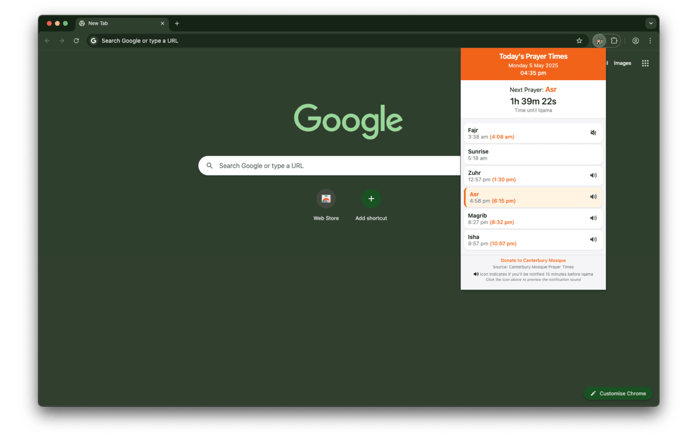

# Canterbury Mosque Prayer Times Extension

A Chrome extension that displays daily prayer times from Canterbury Mosque and provides prayer time notifications with adhan (call to prayer) audio.

[](https://chromewebstore.google.com/detail/canterbury-mosque-prayer/moohpdemicfggnnaeenfndbcfhjnnnof)



## Features

- Displays daily prayer times from Canterbury Mosque
- Prayer time notifications with adhan audio
- Easy-to-use popup interface
- Automatic updates of prayer times
- Customizable notification settings

## Installation

### For Users
1. Download the extension from the [Chrome Web Store](https://chromewebstore.google.com/detail/canterbury-mosque-prayer/moohpdemicfggnnaeenfndbcfhjnnnof)
2. Click "Add to Chrome" to install
3. The extension icon will appear in your Chrome toolbar

### For Developers
1. Clone this repository:
```bash
git clone https://github.com/Adelsamir01/prayer_times_extension.git
```

2. Open Chrome and navigate to `chrome://extensions/`
3. Enable "Developer mode" in the top right
4. Click "Load unpacked" and select the cloned repository directory

## Project Structure

- `manifest.json` - Extension configuration file
- `background.js` - Background service worker for handling notifications and prayer time updates
- `popup.html` & `popup.js` - User interface for the extension popup
- `offscreen.html` - Handles audio playback
- `player.html` - Audio player interface
- `azan.mp3` - Adhan audio file
- `images/` - Extension icons and images

## Customization

To adapt this extension for another mosque:

1. Update the `manifest.json`:
   - Change the extension name and description
   - Update the host permissions to match your mosque's website
   - Modify the icons in the `images/` directory

2. Modify `background.js`:
   - Update the prayer times scraping logic to match your mosque's website structure
   - Adjust the notification settings if needed

3. Update `popup.html` and `popup.js`:
   - Modify the UI to match your mosque's branding
   - Update any mosque-specific information

4. Replace `azan.mp3` with your preferred adhan audio file

## Development

### Prerequisites
- Basic knowledge of JavaScript and HTML
- Understanding of Chrome Extension development
- Chrome browser for testing

### Building
1. Make your modifications to the source code
2. Test the extension locally using Chrome's developer mode
3. Package the extension for distribution:
   - Zip all files (excluding development files)
   - Submit to the Chrome Web Store

## Contributing

Contributions are welcome! Please feel free to submit a Pull Request.

## License

This project is open source and available under the MIT License.

## Support

For support, please:
- Open an issue in the GitHub repository
- Contact the maintainer at adelelzemity@gmail.com

## Credits

- Developed for Canterbury Mosque
- Original adhan audio file included
- Icons and images created for this project
- Developed by Adel Samir ElZemity 